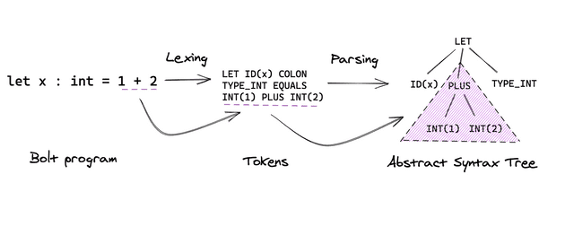

# SQL Parser 开发指南

`parser` 是 `sqlgpt-parser` 的基础模块，它将 SQL 语句按照预定义 SQL 语法规则解析，从文本转换成抽象语法树（`AST`）。

 `sqlgpt-parser` 的 `parser`  基于  [PLY](https://github.com/dabeaz/ply)  编写。PLY 是一个用于构建词法和语法分析器的 Python 工具。它能够根据指定的模式对输入的文本进行分析，它会在程序运行之前，自动编译项目 [sql-parser](../../src/sql_parser/)  文件夹下的词法规则和语法规则文件，生成可执行代码。

## 词法解析与语法解析

 

词法解析和语法解析是 `SQL` 解析的两个步骤，它们的关系如上，词法解析会读取用户的输入，根据词法规则将输入转换为 `tokens` 输出。语法解析则使用词法解析的输出的 `tokens` 作为输入，根据语法规则创建抽象语法树。为了生成满足用户需求的词法解析器和语法解析器，用户需要提供自定义的词法规则和语法规则。在 `PLY` 中，词法规则和语法规则使用两种不同的定义规则。

### 词法规则

```python
import ply.lex as lex

tokens = (
   'NUMBER',
   'PLUS',
   'MINUS',
   'TIMES',
   'DIVIDE',
   'LPAREN',
   'RPAREN',
)

t_PLUS    = r'\+'
t_MINUS   = r'-'
t_TIMES   = r'\*'
t_DIVIDE  = r'/'
t_LPAREN  = r'\('
t_RPAREN  = r'\)'

def t_NUMBER(t):
    r'\d+'
    t.value = int(t.value)    
    return t

lexer = lex.lex()
```

PLY 中 `token` 都用一个正则表达式规则来表示。规则都需要用 `t_` 开头 ，紧跟在 `t_` 之后单词则必须和 `tokens` 列表中某个值相对应。

对于简单的 `token` ，可以直接使用正则表达式定义：

```python
t_PLUS=r'\+'
```

复杂的 `token` 则可以定义成一个函数，当输入字符串匹配正则表达式时，函数内的代码会被执行，在下面的函数中，输入会被转换为整数并存储在 `t.value` 中，并返回 `token` 类型为 `NUMBER` 。

```python
def t_NUMBER(t):
    r'\d+'
    t.value = int(t.value)    
    return t
```

### 语法规则

#### 语法分析基础

```txt
%left '+' '-'
%left '*' '/'
%%
expr:
        INTEGER
        | expr + expr         { $$ = $1 + $3; }
        | expr - expr         { $$ = $1 - $3; }
        | expr * expr         { $$ = $1 * $3; }
        | expr / expr         { $$ = $1 / $3; }
        | '(' expr ')'          { $$ = $2; }

```

第一部分定义了 `token` 类型和运算符的结合性。四种运算符都是左结合，同一行的运算符优先级相同，不同行的运算符，后定义的行具有更高的优先级。

语法规则使用了 `BNF` 定义。`BNF` 可以用来表达上下文无关（*context-free*）语言，大部分的现代编程语言都可以使用 `BNF`表示。上面的规则定义了一个产生式。产生式冒号左边的项  `expr` 被称为非终结符， `INTEGER` 和 `+`，`-`，`*`，`/` 被称为终结符,它们是由词法解析器返回的 `token`。

`PLY` 生成的语法分析器使用自底向上的归约（*shift-reduce*）方式进行语法解析，同时使用堆栈保存中间状态。以下是表达式 `1 + 2 * 3`的解析过程：

```
1    . 1 + 2 * 3
2    1 . + 2 * 3
3    expr . + 2 * 3
4    expr + . 2 * 3
5    expr + 2 . * 3
6    expr + expr . * 3
7    expr + expr * . 3
8    expr + expr * 3 .
9    expr + expr * expr .
10   expr + expr .
11   expr .
```

点（`.`）表示当前的读取位置，随着 `.`从左向右移动，我们将读取的 `token `压入堆栈，当发现堆栈中的内容匹配了文法右部的语法规则，则将匹配的项从堆栈中弹出，将该文法左边的非终结符压入堆栈。这个过程持续进行，直到读取完所有的 `tokens`，并且只有启始非终结符（本例为 `expr`）保留在堆栈中。

产生式右侧的大括号中定义了该规则关联的动作，例如：

```
expr:  expr '+' expr         { $$ = $1 + $3; }
```

我们将堆栈中匹配该产生式右侧的项替换为产生式左侧的非终结符，本例中我们弹出 `expr '*' expr`，然后把 `expr`压回堆栈。 我们可以使用 `$position` 的形式访问堆栈中的项，`$1` 引用的是第一项，`$2` 引用的是第二项，以此类推。`$$` 代表的是归约操作执行后的堆栈顶。本例的动作是将三项从堆栈中弹出，两个表达式相加，结果再压回堆栈顶。

#### 使用 PLY 定义语法规则

```python
import ply.yacc as yacc

# Get the token map from the lexer.  This is required.
from calclex import tokens

precedence = (
    ('left', 'PLUS', 'MINUS'),
    ('left', 'TIMES','DIV'),
)

def p_expr(p):
  """expr : expr PLUS expr
  | expr MINUS expr
  | expr TIMES expr
  | expr DIV expr
  """
  if p.slice[2].type == 'PLUS':
    p[0]=p[1]+p[3]
  elif p.slice[2].type == 'MINUS':
    p[0]=p[1]-p[3]
  elif p.slice[2].type == "TIMES":
    p[0]=p[1]*p[3]
  elif p.slice[2].type == "DIV":
    p[0]=p[1]/p[3]

def p_expr_paren(p):
    """expr : LPAREN expr RPAREN"""
    p[0]=p[2]

def p_expr_number(p):
  """expr : NUMBER"""
  p[0]=p[1]

# Build the parser
parser = yacc.yacc()
```

`precedence` 定义了 `token` 的结合性和优先级。如上列所示，元组中的第一个元素表示 `token ` 的结合性，`left` 表示 `token` 是左结合的，同一行的 `token`  优先级相同，不同行的优先级从低向高排序，上例中  `TIMES` 和 `DIV` 的优先级比 `PLUS` 和 `MINUS` 高。

每个语法规则被定义成 Python的方法，方法的注释描述了该方法相应的上下文无关文法，语句实现了规则的语义行为。每个方法接受一个 `p` 参数，`p` 是一个包含有当前匹配语法的符号的序列，`p[i]` 与语法符号的对应关系如下：

```python
def p_expr_paren(p):
    """expr : LPAREN expr RPAREN"""
    #   ^       ^      ^    ^
    #  p[0]    p[1]   p[2]  p[3]
    p[0] = p[2]
```

`PLY` 使用 `p[position]` 的形式访问堆栈，`p[0]` 相当于上文提到的`$$` ，`p[1]` 相当于`$1`，`p[2]` 相当于`$2`，以此类推。这里的动作则是弹出栈顶的三个元素，将  `p[2]`  值的值赋给 `p[0]`，之后压回堆栈。

## `sqlgpt-parser`的 `parser` 实现

`sqlgpt-parser` 中共有三个 SQL  语法解析器 ，分别在  [mysql_parser](../../src/sql_parser/mysql_parser)、 [oceanbase_parser](../../src/sql_parser/oceanbase_parser) 和  [odps_parser](../../src/sql_parser/odps_parser) 文件夹下，三个文件夹都包含`lexer.py`，`reserved.py`，`parser.py` 三个文件。

`lexer.py` 和`reserved.py` 文件都用于词法解析。`reserved.py` 中定义了 SQL 的关键字，关键字定义在`reserved` 和 `nonreserved` 两个变量中 ，`reserved` 里面包含了所有 `sql` 中不可用作列名、表名或者别名的关键字，`nonreserved` 则是可以用作列名、表名或者别名的关键字。

`lexer.py` 分为两部分，`tokens` 变量中定义了所有可用于 `parser` 的 `token` ，在这里会将 `reserved.py` 中的 SQL 关键词引入，将其变为 `parser` 可用的  `token`。

```python
tokens = (
    [
        'IDENTIFIER',
        'DIGIT_IDENTIFIER',
     		...
    ]
    + list(reserved)
    + list(nonreserved)
)

```

 剩余部分则定义了用户输入会转换成什么样的 `token` 。

```python
...
t_BIT_MOVE_LEFT = r'<<'
t_BIT_MOVE_RIGHT = r'>>'
t_EXCLA_MARK = r'!'

def t_DOUBLE(t):
    r"[0-9]*\.[0-9]+([eE][-+]?[0-9]+)?|[-+]?[0-9]+([eE][-+]?[0-9]+)"
    if 'e' in t.value or 'E' in t.value or '.' in t.value:
        t.type = "FRACTION"
    else:
        t.type = "NUMBER"
    return t
...
```

如上文所述，简单的 `token` 直接使用正则表达式定义，将与正则表达式匹配的值转换为 `t_` 后跟的 `token`，复杂的 `token` 则用方法定义，如`t_DOUBLE` 中，会对读入的值进一步判断，如果是小数，会将值的 `token` 设置为 `FRACTION` ，如果不是小数则设置为`NUMBER` 。

`parser.py` 文件同样分为两个部分，`precedence` 定义了 `token` 的优先级和结合性，剩余部分则定义了相应的语法规则以及对应的 `action` 。

```python
precedence = (
    ('right', 'ASSIGNMENTEQ'),
    ('left', 'PIPES', 'OR'),
    ('left', 'XOR'),
    ('left', 'AND', 'ANDAND'),
    ('right', 'NOT'),
  	...
    ('left', 'EXCLA_MARK'),
    ('left', 'LPAREN'),
    ('right', 'RPAREN'),
)

```

`right` 和 `left` 表示元组中的  `token` 是左结合还是右结合，优先级则是由低向高排列，上面的例子中 `RPAREN` 的优先级最高，`ASSIGNMENTEQ` 优先级最低。

`SQL` 的语法规则十分复杂，`parser.py` 中的大部分内容都是语法规则的定义。 `SQL` 的语法规则可以参照对应数据库的参考手册中的定义。例如 `MySQL` 数据库，可以参照它参考手册的 [SQL Statements](https://dev.mysql.com/doc/refman/8.0/en/sql-statements.html) 部分，其中 `DELETE` 语法定义如下：

```yacas
DELETE [LOW_PRIORITY] [QUICK] [IGNORE] FROM tbl_name [[AS] tbl_alias]
    [PARTITION (partition_name [, partition_name] ...)]
    [WHERE where_condition]
    [ORDER BY ...]
    [LIMIT row_count]
```

我们可以在 `parser.py` 中找到 `DELETE` 的语法规则定义；

```python
def p_delete(p):
    r"""delete : DELETE FROM relations where_opt order_by_opt limit_opt
    | DELETE FROM relations partition where_opt order_by_opt limit_opt
    | DELETE table_name_list FROM relations where_opt order_by_opt limit_opt
    | DELETE table_name_list FROM relations partition where_opt order_by_opt limit_opt
    | DELETE FROM table_name_list USING relations where_opt order_by_opt limit_opt
    | DELETE FROM table_name_list USING relations partition where_opt order_by_opt limit_opt
    """
    length=len(p)
    p_limit = p[length-1]
    if p_limit is not None:
        offset,limit = int(p_limit[0]),int(p_limit[1])  
    else:
        offset,limit=0,0
    if p.slice[3].type=="relations":
        tables,table_refs=p[3],None
    elif p.slice[2].type=="table_name_list":
        tables,table_refs=p[4],p[2]
    else:
        tables,table_refs=p[3],p[5]
    p[0] = Delete(table=tables,table_refs=table_refs,where=p[length-3], order_by=p[length-2], limit=limit, offset=offset)
```

这里 `p_delete` 的注释中语法规则与 `DELETE` 语法是对应的。当输入满足语法规则后，会调用方法中的函数，构建出 `AST ` 的 `DELETE` 节点。

完成语法规则的编写后就可以使用，该语法规则解析 `SQL` 语句，以 `mysql_parser` 为例。

```python
from src.sql_parser.mysql_parser import parser as mysql_parser
sql = "DELETE FROM t WHERE a=1"
result = mysql_parser.parse(sql)
```

执行结果如下图所示，生成了 `SQL` 语句的执行计划树。


## 参考文献

* [TiDB 源码阅读系列文章（五）TiDB SQL Parser 的实现](https://cn.pingcap.com/blog/tidb-source-code-reading-5)

* [PLY](https://github.com/dabeaz/ply)